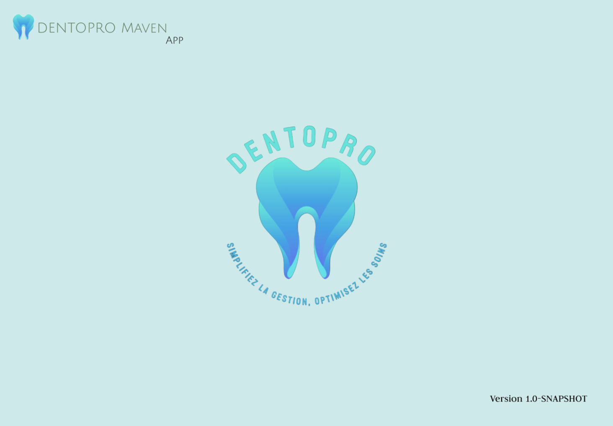
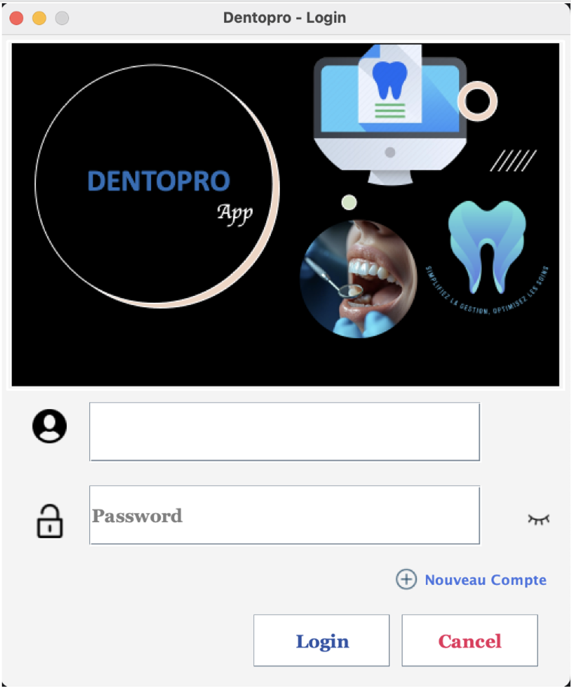
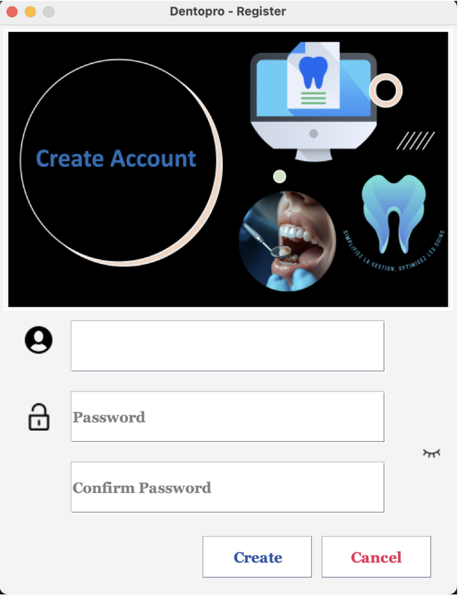
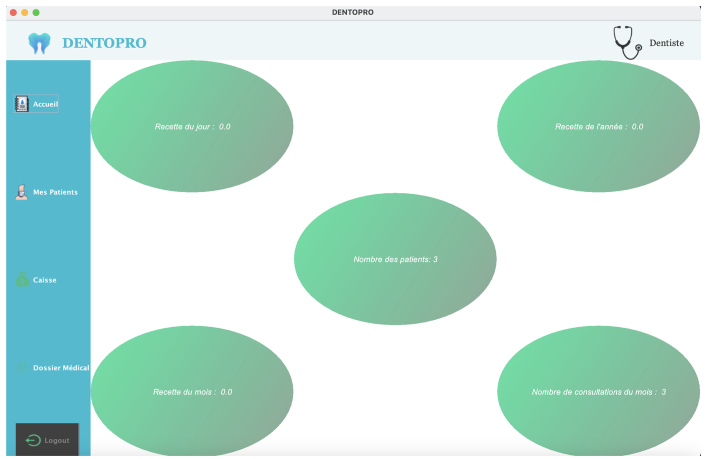
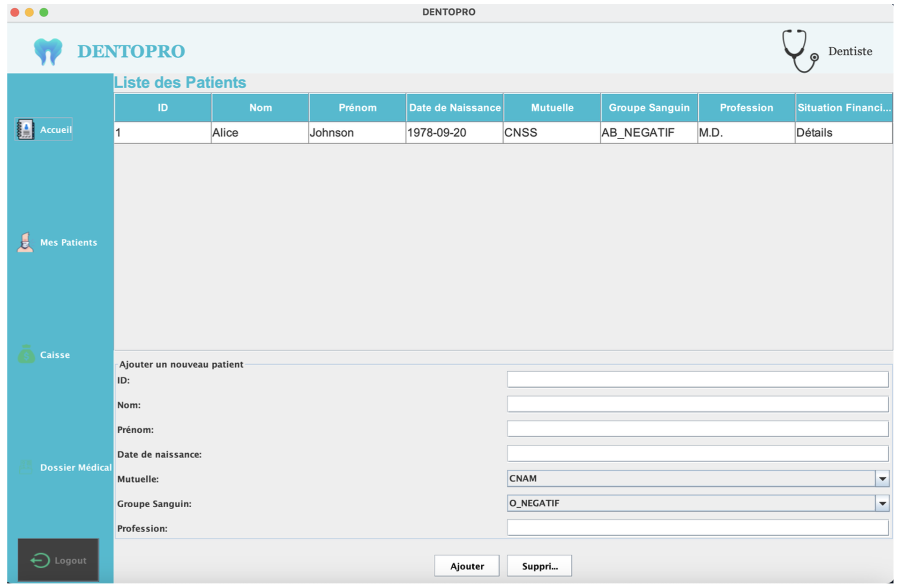

# 🦷 Dentopro — Application de gestion de clinique dentaire (Java Swing)


Application **Java Desktop (Swing)** permettant la gestion complète d’un **cabinet dentaire** : patients, rendez-vous, dossiers médicaux, factures, consultations…

La base de données est **100% fichier texte (`*.txt`)**, sans SGBD externe.  
L’architecture suit le pattern **MVC** avec utilisation de **Maven**, **Lombok** et une interface graphique Swing.

---

## 📌 Sommaire

1. [Fonctionnalités](#-fonctionnalités)
2. [Stack technique](#-stack-technique)
3. [Architecture du projet](#-architecture-du-projet)
4. [Démarrage rapide](#-démarrage-rapide)
    - [Prérequis](#-prérequis)
    - [Configurer le projet](#2-configurer-le-projet)
    - [Lancer l’application](#3-lancer-lapplication)
    - [Comptes de connexion](#-comptes-de-connexion)
5. [Structure de la base de données (fichiers)](#-structure-de-la-base-de-données-fichiers)
6. [Aperçu (UI Screenshots)](#-aperçu-ui-screenshots)
7. [Auteurs](#-auteurs)
8. [Licence](#-licence)

---

## ✅ Fonctionnalités

🧑‍⚕️ Gestion des **patients** (CRUD)  
📅 Gestion des **rendez-vous**  
📁 Gestion des **dossiers médicaux**  
💳 Gestion des **factures & paiements**  
🩺 Historique des consultations  
🔐 Connexion avec rôles (Dentiste / Secrétaire)  
📂 Sauvegarde des données en fichiers `.txt`  
🖥️ Application desktop prête à exécuter (pas de serveur requis)  

---

## 🛠️ Stack technique

| Technologie | Version |
|-------------|---------|
| Java | 23 |
| Interface graphique | Swing |
| Build Tool | Maven |
| Architecture | MVC |
| ORM | Aucun (base fichiers texte) |
| Lombok | ✅ |
| IDE conseillé | IntelliJ IDEA CE |

---

## 🏗️ Architecture du projet

```
ma.dentopro
├─ controller/ → Gestion UI/Events
├─ model/ → Entités (Patient, Facture, Consultation…)
├─ service/ → Logique métier (CRUD, validation…)
├─ repository/ → Manipulation fichiers .txt
├─ view/ → Interfaces Swing (.java)
└─ DentoproApplication.java → Main

```


---

## 🚀 Démarrage rapide

### 1️⃣ Prérequis

✅ Java **23+**  
✅ IntelliJ IDEA (ou équivalent)  
✅ Maven installé **ou** wrapper intégré (`mvnw`)  
✅ Plugin **Lombok** installé dans l’IDE  

---

### 2️⃣ Configurer le projet

1. Cloner ou télécharger le projet  
2. L’ouvrir avec IntelliJ → il détecte `pom.xml` automatiquement  
3. Installer le plugin Lombok si message d’erreur dans l’IDE  
4. Vérifier que les fichiers `.txt` sont présents dans `Dentopro/myFileBase/`

---

### 3️⃣ Lancer l’application

```
# Compilation Maven

mvn clean install

# Ou via IntelliJ

Right click → Run 'DentoproApplication.main()'

```

### ➡️ Le point d’entrée se trouve dans :

```
src/main/java/ma/dentopro/DentoproApplication.java
```

---

## 🔑 Comptes de connexion

| Rôle       | Username | Mot de passe |
| ---------- | -------- | ------------ |
| Dentiste   | admin    | admin        |
| Secrétaire | ranya    | ranya        |


---


## 🗂️ Structure de la base de données (fichiers)

| Fichier `.txt`      | Contenu                            |
| ------------------- | ---------------------------------- |
| `patients.txt`      | Liste des patients                 |
| `rendezvous.txt`    | Agenda des RDV                     |
| `consultations.txt` | Historique clinique                |
| `factures.txt`      | Factures & paiements               |
| `users.txt`         | Identifiants dentiste / secrétaire |


---

## 🎨 Aperçu (UI Screenshots)

| Banner | Login | Register | Dashboard | Gestion des patients |
|--------|-------|----------|-----------|----------------------|
|  |  |  |  |  |


---

## 👥 Auteurs

- **Anas KRIR** — Développeur Back-End / Gestion du projet
- **Adam EL YOURI** — Développeur Front-End / UI & intégration

---

 ## 📄 Licence

Projet sous licence MIT. <br/>
✅ Libre d’utiliser, modifier, distribuer.

© 2024 — KRIR Anas & EL YOURI Adam

---


